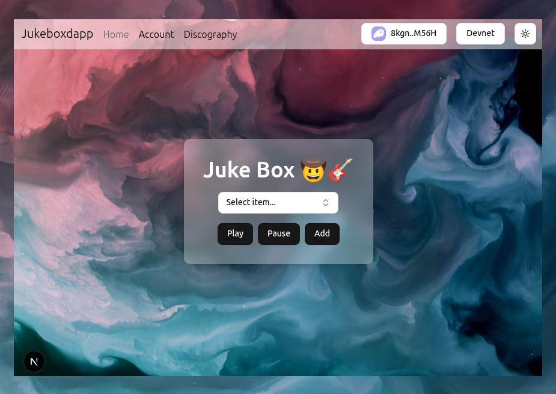

# Project Description

**Deployed Frontend URL:** https://jukebox-dapp.vercel.app/

**Solana Program ID:** HapQLEoaLD5ZvatNkcVBKrCNKDJ4qnRJRMKyVke7cGjb

## Project Overview

### Description
*Juke box* - is a simple-decentralized audio player on Solana where artists can store their favorite discography in a decentralized fashion. Each record (account) is pinned to crypto wallet address using PDA. On the main page there is a music player, which fetches all the discography accounts from on-chain network. All available accounts or music tracks are available for playback.



### Key Features
- **CreateDiscography**: Initialize a new discography account for your wallet
- **UpdateDiscography**: Update discography with a new *song name*, *album* and *song url* 
- **DeleteDiscography**: Removes discography account from chain

### How to use Juke Box
1. **Connect Wallet** - Connect your Solana wallet
2. **Select item** - Select availble songs from the dropdown list
3. **Add** - Click "Add" to create new discography account
4. **Play** - Use "play" button to play the song you selected
5. **Pause** - Click "Pause" to stop music player

## Program Architecture
The Juke Box dApp uses a simple architecture with one main account type and three core instructions. The program leverages PDAs to create unique discography accounts for each user.

### PDA Usage
The program uses Program Derived Addresses to create *Discography* account for each user.

**PDAs Used:**
- **Discography PDA**: Derived from seeds `["discography", payer.key()]` - ensures each user has a unique account that only they can modify.

### Account Structure
```rust
#[account]
#[derive(InitSpace)]
pub struct Discography {
    #[max_len(50)]
    pub album: String,
    #[max_len(50)]
    pub artist: String,
    #[max_len(50)]
    pub song_name: String,
    #[max_len(250)]
    pub song_url: String,
    pub authority: Pubkey,
}
```

## Testing

### Test Coverage
Comprehensive test suite covering all instructions with both successful operations and error conditions to ensure program security and reliability. Navigate to [anchor_project](./anchor_project/README.md) to get more about discography test suite.

**Happy Path Tests:**
- **jukeboxdapp.test.ts**: should create a new discography
- **jukeboxdapp.test.ts**: should update the discography
- **jukeboxdapp.test.ts**: should delete the discography

### Running Tests
```bash
npm install     # install dependencies
anchor test     # run tests
```

### Additional Notes for Evaluators

I enjoyed Solana training course. It was challenging for me to build this app. The most difficult part is Codama client integration and to be honest legacy web3.js looks more robust. I am looking forward to join ackee security team in Prague since this blockchain nowadays a new pation for me (cal.:+420773239167).  
